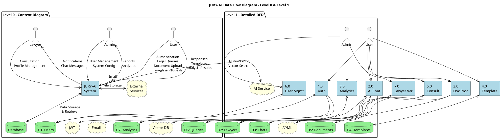

# JURY-AI Complete Data Flow Diagram (DFD)

This file contains the complete merged Data Flow Diagram showing both Context (Level 0) and Detailed (Level 1) views of the JURY-AI system.

## Complete DFD - Combined View

```plantuml
@startuml JURY-AI-Complete-DFD

skinparam backgroundColor #FFFFFF
skinparam rectangle {
    BackgroundColor LightBlue
    BorderColor DarkBlue
    FontSize 12
}
skinparam database {
    BackgroundColor LightGreen
    BorderColor DarkGreen
}
skinparam cloud {
    BackgroundColor LightYellow
    BorderColor Orange
}
skinparam actor {
    BackgroundColor LightCoral
    BorderColor DarkRed
}

title JURY-AI Legal Assistant - Complete Data Flow Diagram

' External Actors
actor "User\n(Client)" as User
actor "Lawyer\n(Consultant)" as Lawyer
actor "Admin\n(System Manager)" as Admin

' Main System Boundary
package "JURY-AI System" {
    
    ' Core Processes
    rectangle "1.0\nAuthentication\nProcess" as P1 {
        :Login/Register
        :JWT Generation
        :Session Management
        :Password Reset
    }
    
    rectangle "2.0\nAI Chat\nProcess" as P2 {
        :Query Processing
        :Vector Search
        :LLM Response
        :Confidence Scoring
    }
    
    rectangle "3.0\nDocument\nProcessing" as P3 {
        :File Upload
        :Text Extraction
        :AI Analysis
        :Risk Assessment
    }
    
    rectangle "4.0\nTemplate\nManagement" as P4 {
        :Browse Templates
        :Field Filling
        :Download Tracking
        :Template CRUD
    }
    
    rectangle "5.0\nLawyer\nConsultation" as P5 {
        :Chat Initiation
        :Message Exchange
        :Consultation Tracking
        :Status Management
    }
    
    rectangle "6.0\nUser\nManagement" as P6 {
        :User CRUD
        :Role Assignment
        :Profile Management
        :Account Control
    }
    
    rectangle "7.0\nLawyer\nVerification" as P7 {
        :Application Review
        :Document Verification
        :Approval/Rejection
        :Credential Check
    }
    
    rectangle "8.0\nAnalytics\nProcess" as P8 {
        :Event Tracking
        :Usage Statistics
        :Performance Metrics
        :Report Generation
    }
}

' Data Stores
database "D1: Users\nCollection" as D1 {
    ' User accounts
    ' Profiles
    ' Credentials
}

database "D2: Lawyers\nCollection" as D2 {
    ' Lawyer profiles
    ' Specializations
    ' Verification status
}

database "D3: Chats\nCollection" as D3 {
    ' Conversations
    ' Messages
    ' Chat metadata
}

database "D4: Templates\nCollection" as D4 {
    ' Legal templates
    ' Categories
    ' Download counts
}

database "D5: Documents\nCollection" as D5 {
    ' Uploaded files
    ' Analysis results
    ' Metadata
}

database "D6: Legal Queries\nCollection" as D6 {
    ' AI queries
    ' Responses
    ' Feedback
}

database "D7: Analytics\nCollection" as D7 {
    ' Events
    ' Metrics
    ' Logs
}

' External Services
cloud "External Services" {
    cloud "JWT Service\n(Token Auth)" as JWT
    cloud "AI/ML Engine\n(Gemini + LangChain)" as AI
    cloud "Vector Database\n(Pinecone)" as Vector
    cloud "Email Service\n(Notifications)" as Email
    cloud "File Storage\n(Local FS)" as Storage
}

' ============================================
' USER FLOWS - Level 0 & Level 1 Combined
' ============================================

' Authentication Flow
User -down-> P1 : <<1>> Login/Register\nCredentials
P1 -down-> D1 : <<1.1>> Store/Retrieve\nUser Data
P1 -right-> JWT : <<1.2>> Generate\nJWT Token
JWT -up-> P1 : <<1.3>> Return Token
P1 -right-> Email : <<1.4>> Send\nVerification Email
P1 -up-> User : <<1.5>> Auth Response\n+ Session Cookie

' AI Chat Flow
User -down-> P2 : <<2>> Ask Legal\nQuestion
P2 -down-> D6 : <<2.1>> Store\nQuery
P2 -right-> AI : <<2.2>> Process with\nLLM
AI -up-> P2 : <<2.3>> AI Response
P2 -right-> Vector : <<2.4>> Vector\nSearch
Vector -up-> P2 : <<2.5>> Relevant Docs
P2 -down-> D7 : <<2.6>> Track\nAnalytics
P2 -up-> User : <<2.7>> Answer +\nSources

' Document Processing Flow
User -down-> P3 : <<3>> Upload\nDocument
P3 -down-> D5 : <<3.1>> Store\nDocument
P3 -right-> Storage : <<3.2>> Save\nFile
P3 -right-> AI : <<3.3>> Analyze\nContent
AI -up-> P3 : <<3.4>> Analysis\nResults
P3 -up-> User : <<3.5>> Analysis +\nSuggestions

' Template Management Flow
User -down-> P4 : <<4>> Browse/Download\nTemplates
P4 <-down-> D4 : <<4.1>> Template\nData
P4 -right-> Storage : <<4.2>> Retrieve\nFiles
P4 -up-> User : <<4.3>> Template +\nGenerated Doc

' Lawyer Consultation Flow
User -down-> P5 : <<5>> Request\nConsultation
P5 <-down-> D3 : <<5.1>> Chat\nData
P5 <-down-> D2 : <<5.2>> Lawyer\nInfo
P5 -up-> User : <<5.3>> Chat\nMessages
P5 -up-> Lawyer : <<5.4>> Client\nMessages

' ============================================
' LAWYER FLOWS
' ============================================

Lawyer -down-> P5 : <<6>> Provide\nConsultation
Lawyer -down-> P1 : <<7>> Profile\nManagement

' ============================================
' ADMIN FLOWS
' ============================================

' User Management
Admin -down-> P6 : <<8>> Manage\nUsers
P6 <-down-> D1 : <<8.1>> User\nData CRUD
P6 -up-> Admin : <<8.2>> User\nReports

' Lawyer Verification
Admin -down-> P7 : <<9>> Verify\nLawyers
P7 <-down-> D2 : <<9.1>> Lawyer\nData
P7 -right-> Email : <<9.2>> Approval/\nRejection Email
P7 -up-> Admin : <<9.3>> Verification\nStatus

' Analytics
Admin -down-> P8 : <<10>> View\nAnalytics
P8 <-down-> D7 : <<10.1>> Analytics\nData
P8 <-down-> D1 : <<10.2>> User\nMetrics
P8 <-down-> D6 : <<10.3>> Query\nStats
P8 -up-> Admin : <<10.4>> Reports +\nDashboards

' ============================================
' SYSTEM INTEGRATION FLOWS
' ============================================

' Cross-process data flows
P2 ..> D1 : User Context
P3 ..> D1 : User Context
P4 ..> D1 : User Context
P5 ..> D1 : User Context

P8 ..> D2 : Lawyer Stats
P8 ..> D3 : Chat Stats
P8 ..> D4 : Template Stats
P8 ..> D5 : Document Stats

' Legend
legend right
    |= Symbol |= Meaning |
    | <<N>> | Data Flow Number |
    | -→ | Primary Data Flow |
    | ..> | Secondary/Context Flow |
    | D1-D7 | Data Stores |
    | P1-P8 | Processes |
endlegend

@enduml
```

## Alternative: Side-by-Side View



## Simplified Merged DFD (For Presentations)

```plantuml
@startuml JURY-AI-DFD-Simplified

skinparam backgroundColor #FFFFFF
skinparam defaultFontSize 11

title JURY-AI Complete Data Flow - Simplified View

' Actors
actor User #LightCoral
actor Lawyer #LightCoral
actor Admin #LightCoral

' System Boundary
rectangle "JURY-AI Platform" #LightBlue {
    
    ' Core Processes
    (Authentication) as Auth
    (AI Chat) as Chat
    (Document Analysis) as Doc
    (Templates) as Temp
    (Consultation) as Consult
    (User Management) as UserMgmt
    (Lawyer Verification) as LawyerVer
    (Analytics) as Analytics
    
    ' Data Stores
    database "MongoDB\nCollections" as DB {
        [Users]
        [Lawyers]
        [Chats]
        [Templates]
        [Documents]
        [Queries]
        [Analytics]
    }
}

' External Services
cloud "Services" as Services {
    [JWT]
    [Gemini AI]
    [Pinecone]
    [Email]
}

' User Interactions
User --> Auth : Login/Register
User --> Chat : Ask Questions
User --> Doc : Upload Docs
User --> Temp : Browse/Download
User --> Consult : Request Help

' Lawyer Interactions
Lawyer --> Consult : Provide Advice
Lawyer --> Auth : Manage Profile

' Admin Interactions
Admin --> UserMgmt : Manage Users
Admin --> LawyerVer : Verify Lawyers
Admin --> Analytics : View Reports

' Process to Database
Auth --> DB : User Data
Chat --> DB : Queries
Doc --> DB : Documents
Temp --> DB : Templates
Consult --> DB : Chats
UserMgmt --> DB : User CRUD
LawyerVer --> DB : Lawyer Data
Analytics --> DB : Metrics

' Process to Services
Auth --> Services : JWT + Email
Chat --> Services : AI + Pinecone
Doc --> Services : AI Analysis

' Reverse flows
DB --> Auth : Retrieve
DB --> Chat : Context
DB --> Analytics : Stats

Services --> Chat : Responses
Services --> Doc : Analysis

@enduml
```

---

## How to Use This Merged DFD:

### 1. **Complete View** (First Diagram)
- Shows all processes (P1-P8) with detailed flows
- Numbered data flows (<<1>>, <<2>>, etc.)
- All 7 data stores clearly labeled
- External services integrated
- Best for: Technical documentation, system design reviews

### 2. **Side-by-Side View** (Second Diagram)
- Level 0 and Level 1 displayed together
- Easy comparison between context and detailed views
- Best for: Presentations, stakeholder meetings

### 3. **Simplified View** (Third Diagram)
- Clean, minimalist design
- High-level overview
- Best for: Executive summaries, quick reference

### To Generate Images:

```bash
# Save to file
cat > jury-ai-complete-dfd.puml << 'EOF'
[paste diagram code here]
EOF

# Generate PNG
plantuml jury-ai-complete-dfd.puml

# Generate SVG (better for scaling)
plantuml -tsvg jury-ai-complete-dfd.puml

# Generate all formats
plantuml -tpng -tsvg -teps jury-ai-complete-dfd.puml
```

### Online Rendering:
- http://www.plantuml.com/plantuml/uml/
- https://www.planttext.com/
- Copy the code and paste to visualize instantly

---

*Complete Data Flow Diagram for JURY-AI Legal Assistant Platform*
*Combines Context (Level 0) and Detailed (Level 1) views*
