# JURY-AI PlantUML Diagrams

This document contains all PlantUML code for the JURY-AI Legal Assistant Platform diagrams.

## Table of Contents
1. [UML Class Diagram](#1-uml-class-diagram)
2. [Entity Relationship Diagram](#2-entity-relationship-diagram)
3. [System Architecture Diagram](#3-system-architecture-diagram)
4. [Data Flow Diagram](#4-data-flow-diagram)
5. [Flowcharts](#5-flowcharts)
6. [Sequence Diagrams](#6-sequence-diagrams)

---

## 1. UML Class Diagram

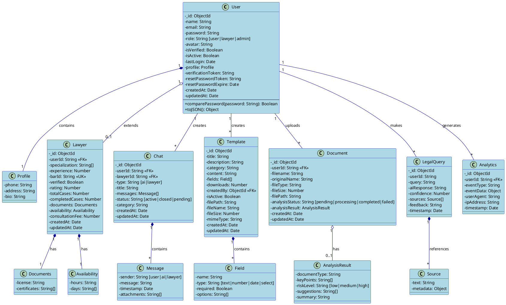

---

## 2. Entity Relationship Diagram

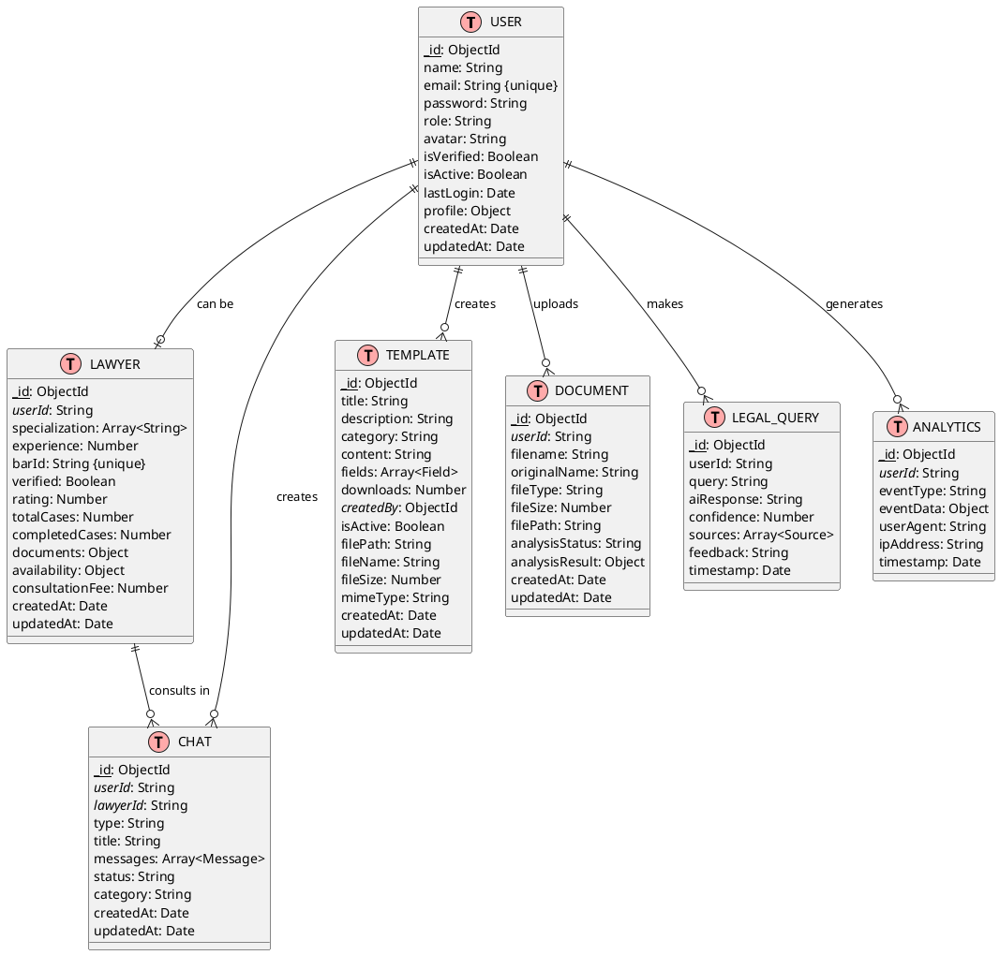

---

## 3. System Architecture Diagram

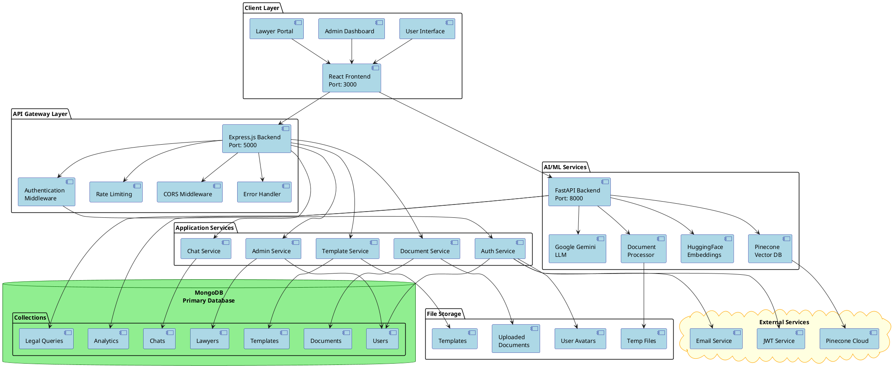

---

## 4. Data Flow Diagram

### Level 0 - Context Diagram

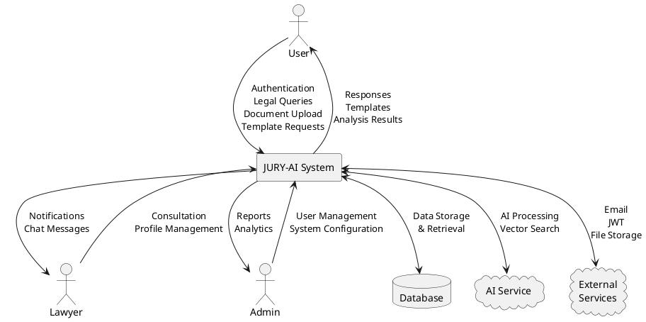

### Level 1 - Detailed DFD

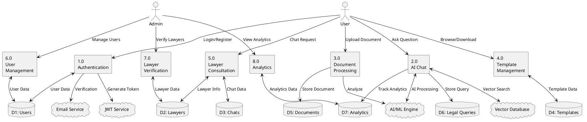

---

## 5. Flowcharts

### 5.1 User Authentication Flow

```plantuml
@startuml Authentication-Flow

skinparam backgroundColor #FFFFFF
skinparam activityBackgroundColor LightBlue
skinparam activityBorderColor DarkBlue

start

:User Visits Platform;

if (Authenticated?) then (yes)
    :Show Home Page;
    
    if (User Role?) then (User)
        :User Dashboard;
    else (Lawyer)
        :Lawyer Dashboard;
    else (Admin)
        :Admin Dashboard;
    endif
    
else (no)
    :Show Login/Register;
    
    if (User Choice?) then (Login)
        :Enter Email & Password;
        
        if (Valid Credentials?) then (no)
            :Show Error Message;
            stop
        else (yes)
            :Generate JWT Token;
        endif
        
    else (Register)
        :Enter Name, Email,\nPassword, Role;
        
        if (Valid Data?) then (no)
            :Show Validation Errors;
            stop
        else (yes)
            :Create User in Database;
            :Generate JWT Token;
        endif
    endif
    
    :Set HTTP-Only Cookie;
    :Update Last Login;
    :Redirect to Dashboard;
endif

stop

@enduml
```

### 5.2 AI Chat Query Flow

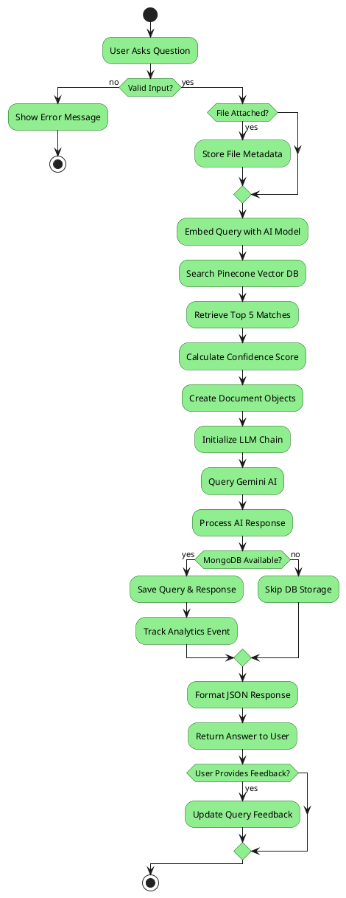

### 5.3 Document Upload & Analysis Flow

```plantuml
@startuml Document-Upload-Flow

skinparam backgroundColor #FFFFFF
skinparam activityBackgroundColor LightYellow
skinparam activityBorderColor Orange

start

:User Uploads Document;

if (Valid File?) then (no)
    :Show Error:\nInvalid File Type/Size;
    stop
else (yes)
    :Save File to Server;
    :Create Document Record in DB;
    :Set Status: 'pending';
    :Start Document Analysis;
    :Update Status: 'processing';
    
    fork
        :Extract Text from Document;
    fork again
        :Analyze Content with AI;
    end fork
    
    :Identify Document Type;
    :Extract Key Points;
    :Assess Risk Level;
    :Generate Suggestions;
    :Create Summary;
    :Save Analysis Results to DB;
    :Update Status: 'completed';
    :Notify User;
    :Display Analysis Results;
    
    if (User Action?) then (Download)
        :Download Document;
    else (Share)
        :Share with Lawyer;
    else (Delete)
        :Delete Document;
    else (View More)
        :Show Detailed Analysis;
    endif
endif

stop

@enduml
```

### 5.4 Template Management Flow

```plantuml
@startuml Template-Management-Flow

skinparam backgroundColor #FFFFFF
skinparam activityBackgroundColor LightPink
skinparam activityBorderColor DarkRed

start

:Access Templates;

if (User Role?) then (User)
    :View Available Templates;
    
    if (Filter by Category?) then (yes)
        :Apply Category Filter;
        :Show Filtered Templates;
    else (no)
        :Show All Templates;
    endif
    
    :User Selects Template;
    :Show Template Details;
    
    if (User Action?) then (Preview)
        :Preview Content;
    else (Download)
        :Download Template;
        :Increment Download Counter;
        :Generate Document;
        :Save to User Documents;
    else (Fill Form)
        if (All Required Fields?) then (no)
            :Show Missing Fields;
        else (yes)
            :Generate Custom Document;
            :Save to User Documents;
        endif
    endif
    
else (Admin)
    :Manage Templates;
    
    if (Admin Action?) then (Create)
        :Enter Template Details;
        :Define Dynamic Fields;
        :Save Template to DB;
    else (Edit)
        :Load Template Data;
        :Modify Template;
        :Save Template to DB;
    else (Delete)
        if (Confirm?) then (yes)
            :Remove from DB;
        endif
    else (Upload)
        if (Valid File?) then (yes)
            :Process File;
            :Save Template to DB;
        else (no)
            :Show Error;
        endif
    endif
endif

stop

@enduml
```

---

## 6. Sequence Diagrams

### 6.1 User Authentication Sequence

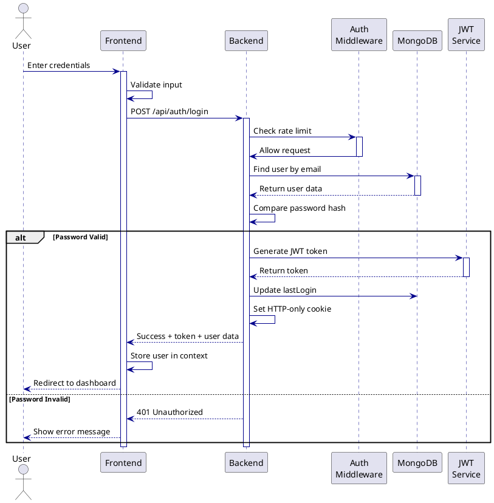

### 6.2 AI Chat Query Sequence

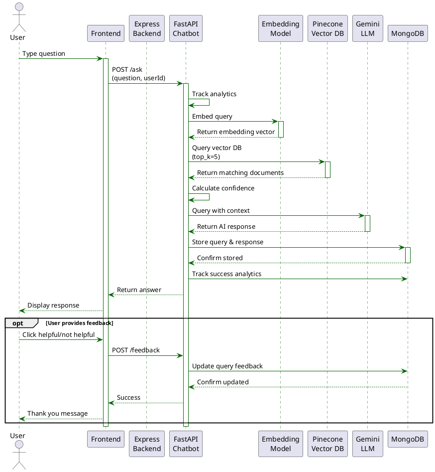

### 6.3 Document Upload & Analysis Sequence

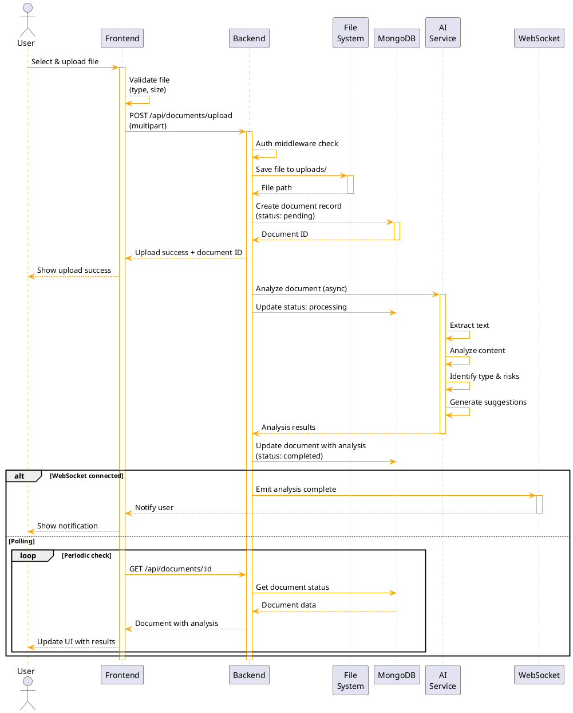

### 6.4 Template Download Sequence

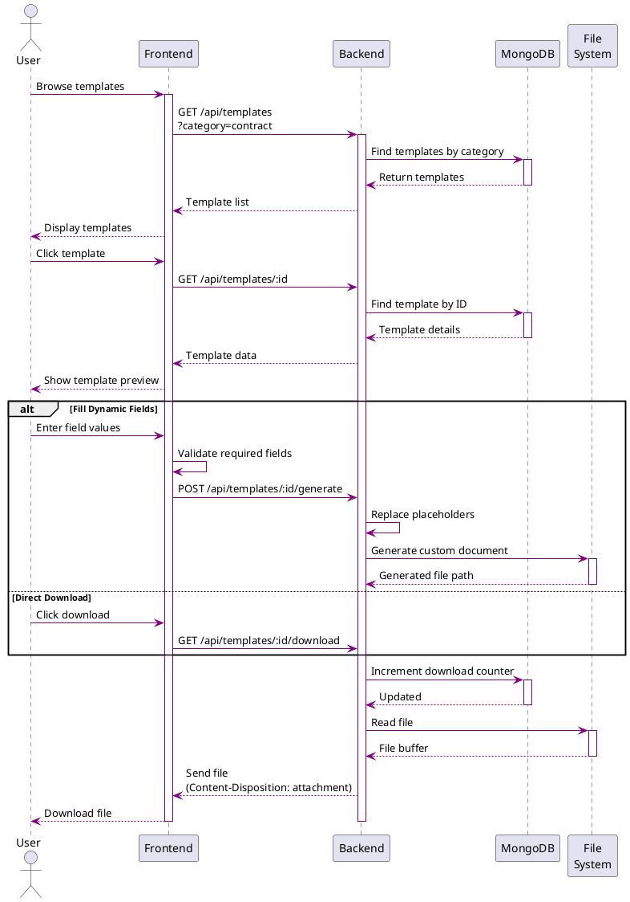

### 6.5 Admin Lawyer Verification Sequence

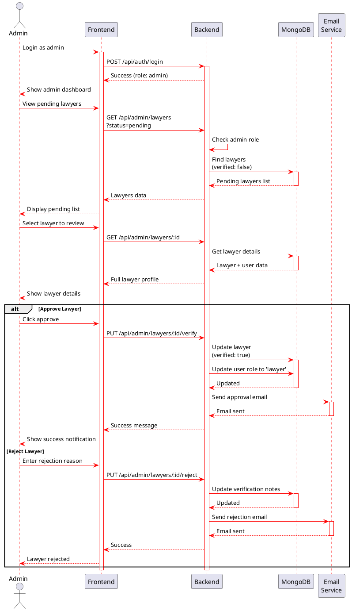

---

## How to Use These Diagrams

### Online Tools:
1. **PlantUML Online Server**: http://www.plantuml.com/plantuml/uml/
2. **PlantText**: https://www.planttext.com/
3. **Kroki**: https://kroki.io/

### VS Code:
1. Install "PlantUML" extension
2. Create `.puml` files with the code above
3. Press `Alt+D` to preview

### Command Line:
```bash
# Install PlantUML
sudo apt-get install plantuml

# Generate PNG
plantuml diagram.puml

# Generate SVG
plantuml -tsvg diagram.puml
```

### Integration:
- Copy individual diagram codes into separate `.puml` files
- Generate images for documentation
- Include in README or wiki pages
- Use in presentations

---

*Generated for JURY-AI Legal Assistant Platform*
*Date: November 11, 2025*
