# JURY-AI System Diagrams

## Table of Contents
1. [UML Class Diagram](#1-uml-class-diagram)
2. [Entity Relationship Diagram](#2-entity-relationship-diagram-erd)
3. [System Architecture Diagram](#3-system-architecture-diagram)
4. [Data Flow Diagram](#4-data-flow-diagram-dfd)
5. [Flowchart - User Journey](#5-flowchart---user-journey)
6. [Sequence Diagrams](#6-sequence-diagrams)

---

## 1. UML Class Diagram

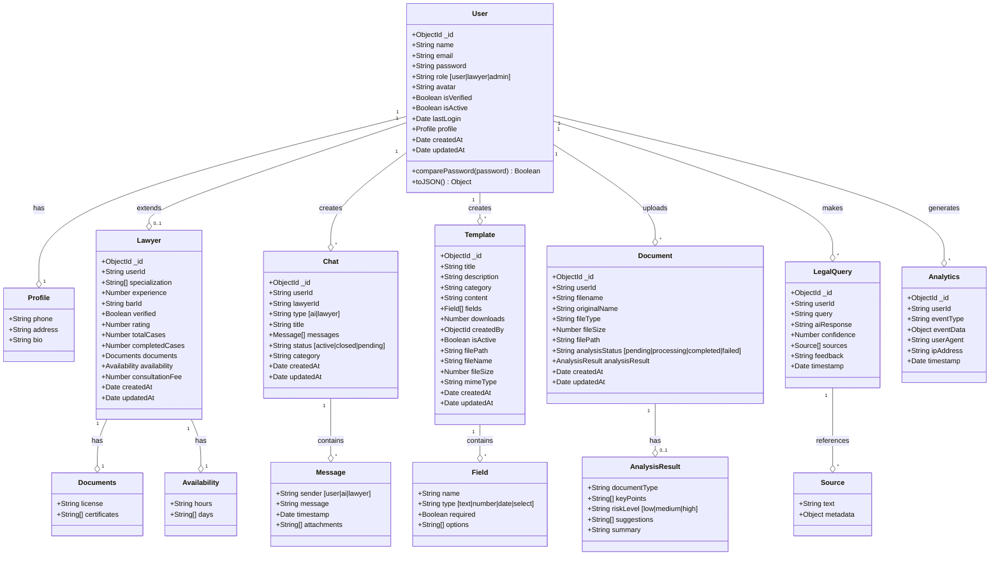

---

## 2. Entity Relationship Diagram (ERD)

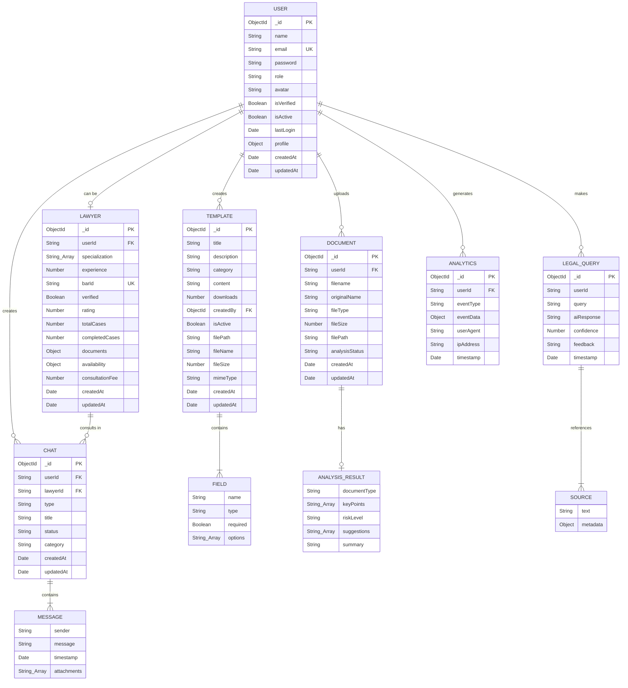

---

## 3. System Architecture Diagram

```mermaid
graph TB
    subgraph "Client Layer"
        A[React Frontend<br/>Port: 3000]
        A1[User Interface]
        A2[Admin Dashboard]
        A3[Lawyer Portal]
    end

    subgraph "API Gateway Layer"
        B[Express.js Backend<br/>Port: 5000]
        B1[Authentication Middleware]
        B2[Rate Limiting]
        B3[CORS Middleware]
        B4[Error Handler]
    end

    subgraph "Application Services"
        C1[Auth Service]
        C2[Chat Service]
        C3[Template Service]
        C4[Admin Service]
        C5[Document Service]
    end

    subgraph "AI/ML Services"
        D[FastAPI Chatbot Backend<br/>Port: 8000]
        D1[LLM Service<br/>Google Gemini]
        D2[Vector Store<br/>Pinecone]
        D3[Embedding Model<br/>HuggingFace]
        D4[Document Processor]
    end

    subgraph "Data Layer"
        E[(MongoDB<br/>Primary Database)]
        E1[Users Collection]
        E2[Lawyers Collection]
        E3[Chats Collection]
        E4[Templates Collection]
        E5[Documents Collection]
        E6[Legal Queries Collection]
        E7[Analytics Collection]
    end

    subgraph "Storage Layer"
        F[File System]
        F1[Uploaded Documents]
        F2[User Avatars]
        F3[Templates]
        F4[Temp Files]
    end

    subgraph "External Services"
        G1[JWT Service]
        G2[Email Service]
        G3[Pinecone Cloud]
    end

    A --> B
    A1 --> A
    A2 --> A
    A3 --> A
    
    B --> B1
    B --> B2
    B --> B3
    B --> B4
    
    B1 --> C1
    B --> C2
    B --> C3
    B --> C4
    B --> C5
    
    C1 --> E1
    C2 --> E3
    C3 --> E4
    C4 --> E1
    C4 --> E2
    C5 --> E5
    
    A --> D
    D --> D1
    D --> D2
    D --> D3
    D --> D4
    
    D --> E6
    D --> E7
    D2 --> G3
    
    C5 --> F1
    C1 --> F2
    C3 --> F3
    D4 --> F4
    
    C1 --> G1
    C1 --> G2
    
    style A fill:#61dafb
    style B fill:#68a063
    style D fill:#009688
    style E fill:#47a248
    style F fill:#ffa500
```

---

## 4. Data Flow Diagram (DFD)

### Level 0 - Context Diagram

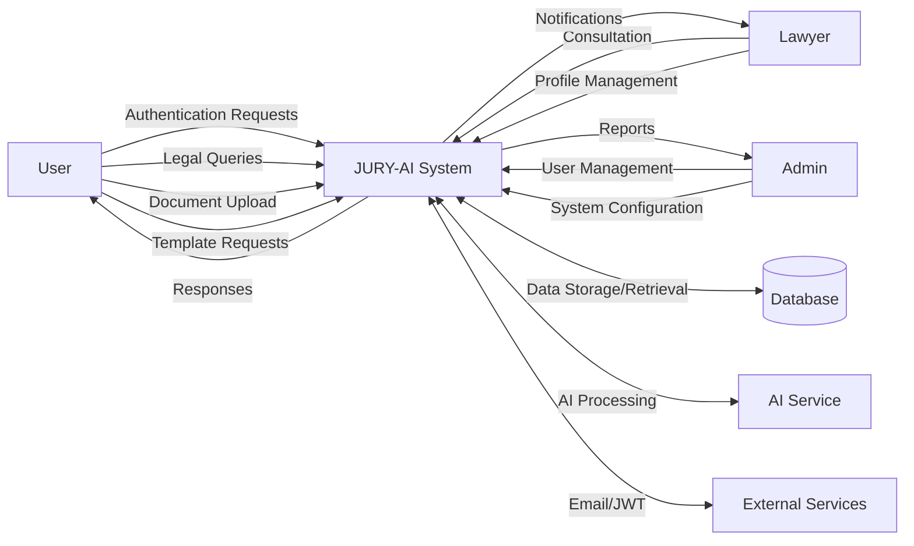

### Level 1 - Detailed DFD

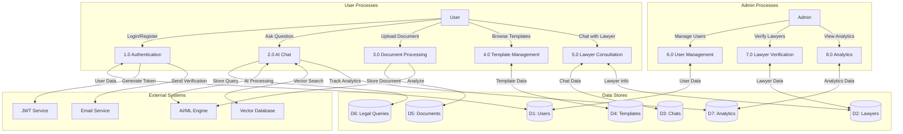

---

## 5. Flowchart - User Journey

### User Authentication Flow

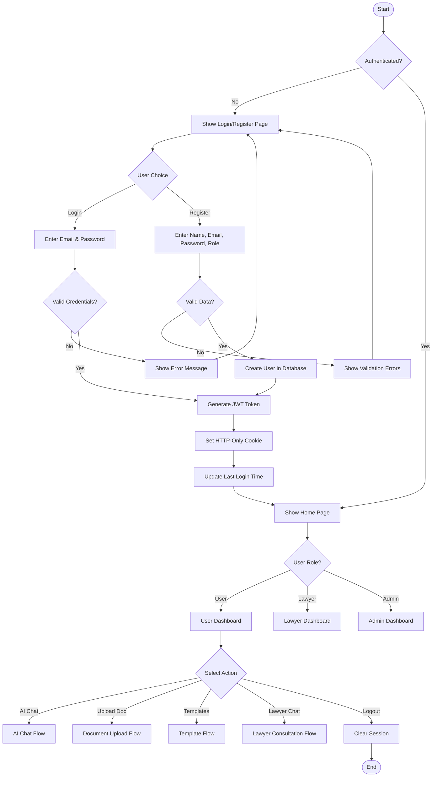

### AI Chat Flow

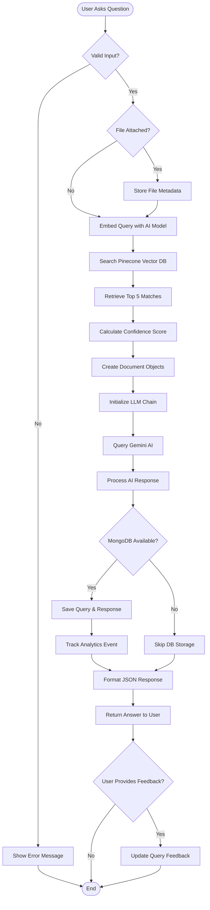

### Document Upload & Analysis Flow

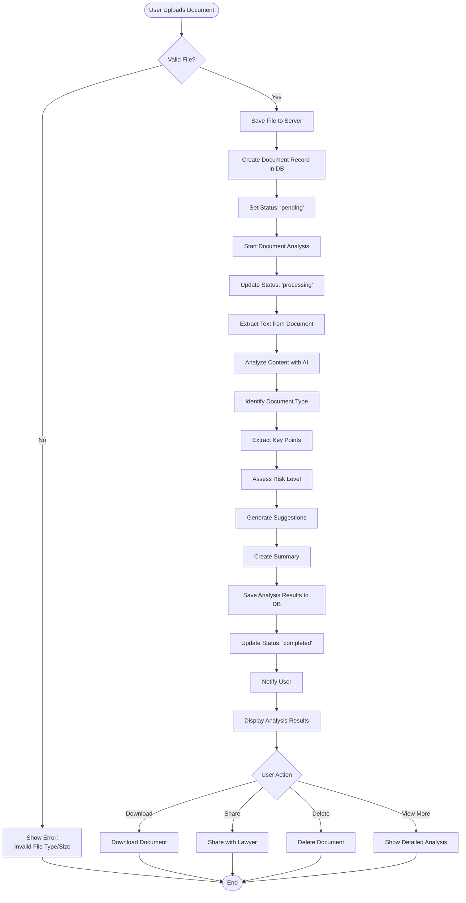

### Template Management Flow

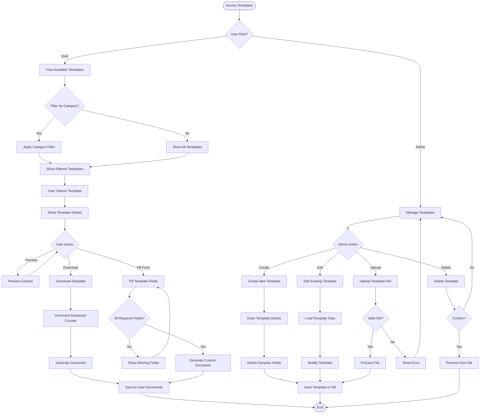

---

## 6. Sequence Diagrams

### User Authentication Sequence

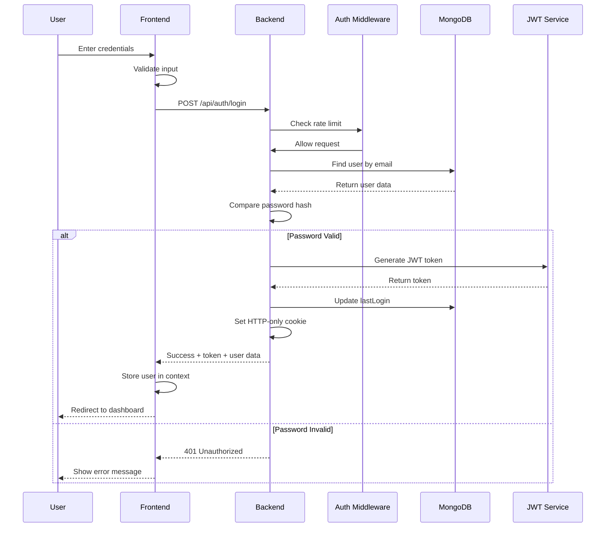

### AI Chat Query Sequence

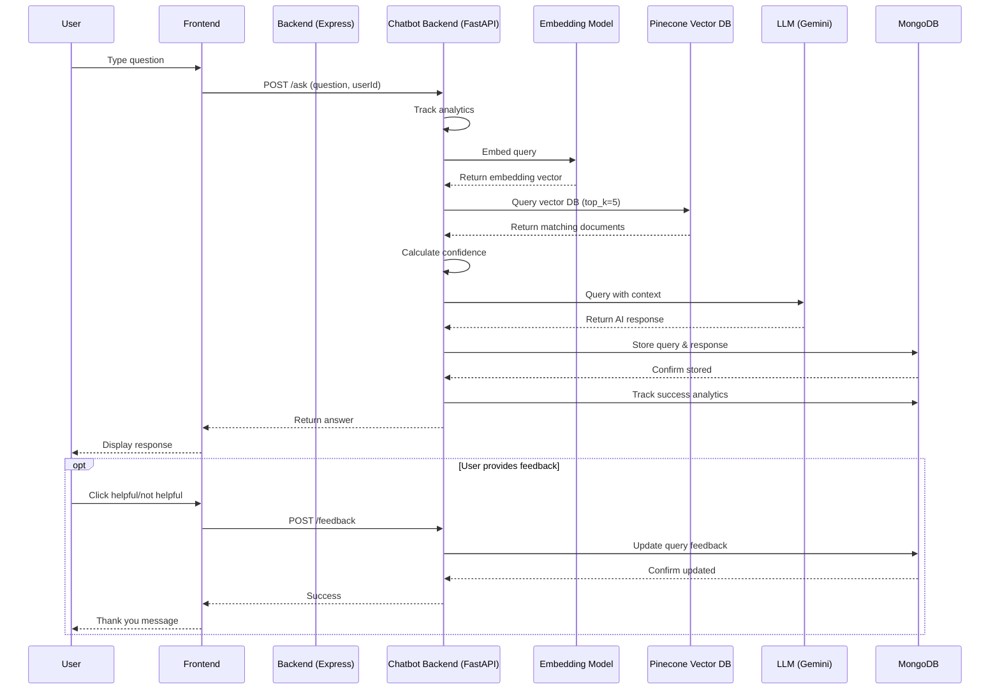

### Document Upload & Analysis Sequence

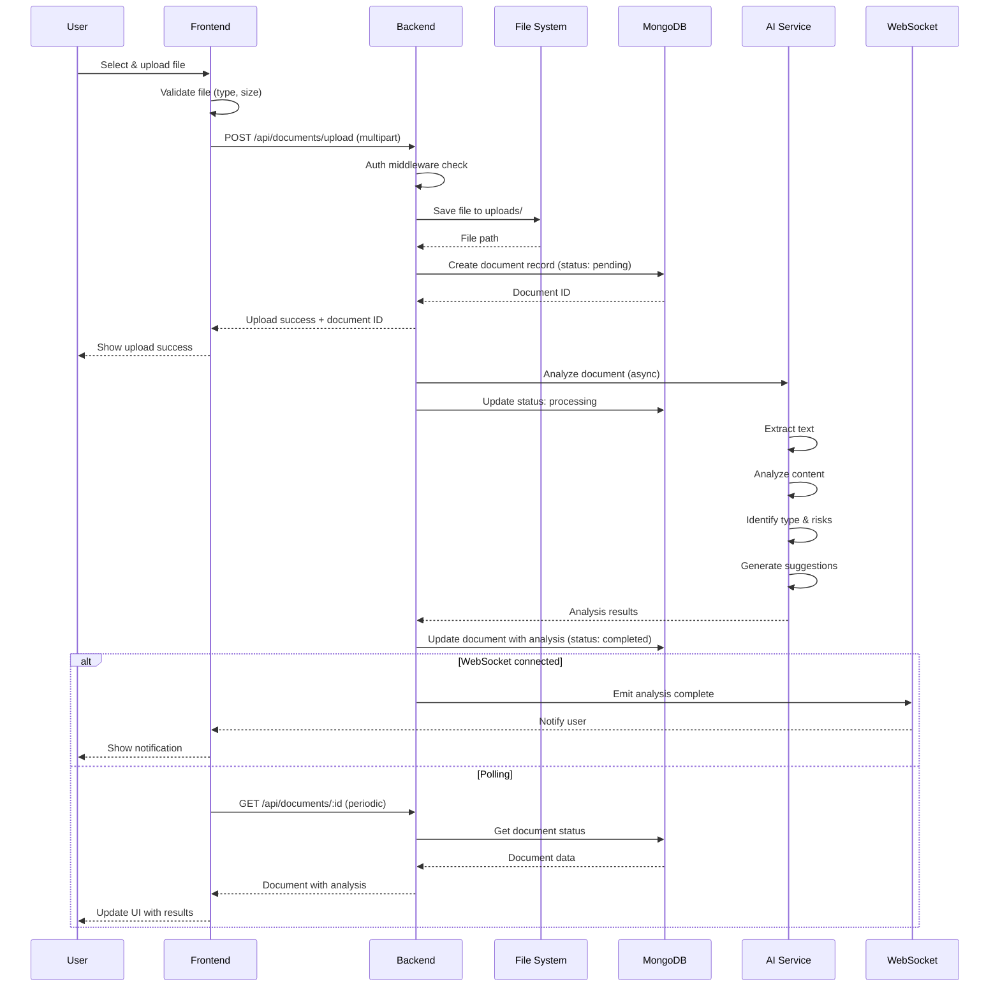

### Template Download Sequence

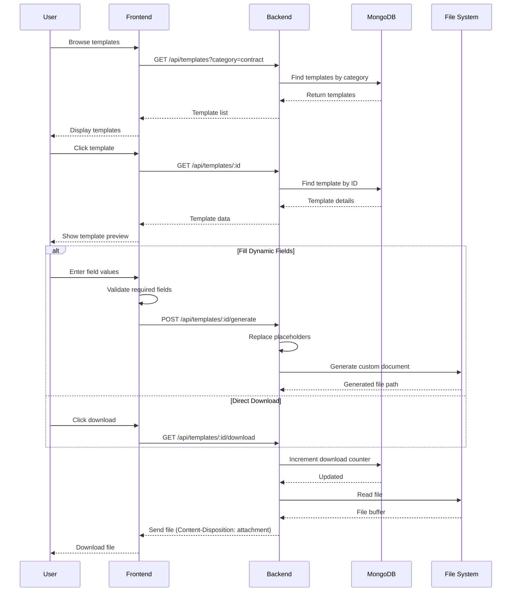

### Admin - Lawyer Verification Sequence

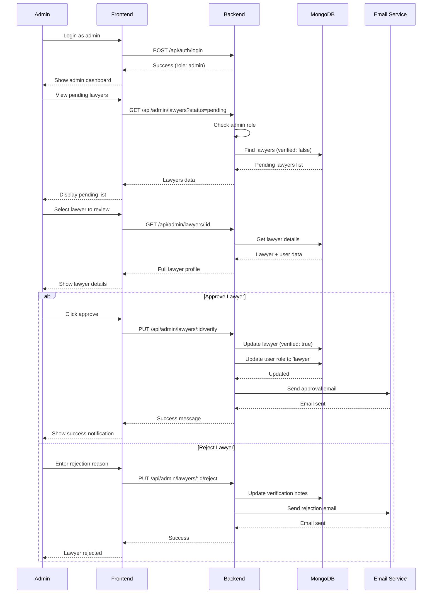

---

## Technology Stack

### Frontend
- **Framework**: React.js with TypeScript
- **State Management**: React Context API
- **Routing**: React Router
- **HTTP Client**: Axios
- **UI Components**: Custom components
- **Styling**: CSS/Styled Components

### Backend (Express)
- **Runtime**: Node.js
- **Framework**: Express.js with TypeScript
- **Authentication**: JWT (jsonwebtoken)
- **Security**: Helmet, CORS, Rate Limiting
- **File Upload**: Multer
- **WebSocket**: Socket.io

### Backend (FastAPI - AI Service)
- **Framework**: FastAPI (Python)
- **LLM**: Google Gemini AI
- **Embeddings**: HuggingFace Models
- **Vector Store**: Pinecone
- **Document Processing**: LangChain
- **Async Processing**: Python asyncio

### Database
- **Primary DB**: MongoDB with Mongoose
- **Collections**: 
  - Users
  - Lawyers
  - Chats
  - Templates
  - Documents
  - Legal Queries
  - Analytics

### File Storage
- **Strategy**: File System (local storage)
- **Directories**:
  - `/uploads/avatars`
  - `/uploads/documents`
  - `/uploads/templates`
  - `/uploads/temp`

### External Services
- **Vector Database**: Pinecone Cloud
- **AI Model**: Google Gemini API
- **Email**: Email service (configurable)

---

## Key Features

1. **Multi-Role Authentication System**
   - User, Lawyer, and Admin roles
   - JWT-based authentication
   - Role-based access control

2. **AI-Powered Legal Assistant**
   - Natural language query processing
   - Vector-based document search
   - Context-aware responses
   - Confidence scoring

3. **Document Management**
   - Upload and storage
   - AI-powered analysis
   - Risk assessment
   - Key point extraction

4. **Template System**
   - Category-based organization
   - Dynamic field filling
   - Download tracking
   - Admin management

5. **Chat System**
   - AI chat for legal queries
   - Lawyer consultation
   - Message history
   - File attachments

6. **Admin Dashboard**
   - User management
   - Lawyer verification
   - Analytics and reporting
   - System configuration

7. **Analytics & Monitoring**
   - Query tracking
   - User behavior analytics
   - System health monitoring
   - Performance metrics

---

## Security Features

- **Authentication**: JWT tokens with HTTP-only cookies
- **Password Security**: bcrypt hashing with salt
- **Rate Limiting**: Request throttling per IP
- **CORS**: Configured for specific origins
- **Helmet**: Security headers
- **Input Validation**: Request data validation
- **File Upload Security**: File type and size validation
- **Role-Based Access**: Middleware-based authorization

---

## Deployment Considerations

### Backend (Express)
- Port: 5000
- Environment: development/production
- Database: MongoDB connection string
- JWT Secret: Secure random string
- File Storage: Persistent volume

### Chatbot Backend (FastAPI)
- Port: 8000
- Python: 3.8+
- Dependencies: requirements.txt
- API Keys: Pinecone, Google Gemini
- Model Cache: In-memory caching

### Frontend
- Port: 3000
- Build: Production-optimized bundle
- Environment Variables: API endpoints
- Static Assets: CDN/Server

### Database
- MongoDB Atlas or self-hosted
- Replica set for production
- Regular backups
- Index optimization

---

## API Endpoints Summary

### Authentication (`/api/auth`)
- POST `/register` - User registration
- POST `/login` - User login
- POST `/logout` - User logout
- GET `/profile` - Get user profile
- PUT `/profile` - Update profile

### Admin (`/api/admin`)
- GET `/users` - List users
- GET `/lawyers` - List lawyers
- PUT `/lawyers/:id/verify` - Verify lawyer
- DELETE `/users/:id` - Delete user
- GET `/stats` - System statistics

### Chat (`/api/chat`)
- GET `/` - Get user chats
- POST `/` - Create new chat
- GET `/:id` - Get chat details
- POST `/:id/messages` - Send message

### Templates (`/api/templates`)
- GET `/` - List templates
- GET `/:id` - Get template
- POST `/` - Create template (admin)
- PUT `/:id` - Update template (admin)
- DELETE `/:id` - Delete template (admin)
- GET `/:id/download` - Download template

### AI Chatbot (`/ask`)
- POST `/` - Ask question
- POST `/feedback` - Submit feedback
- GET `/history/:userId` - Query history
- GET `/analytics` - Analytics summary

---

## Performance Optimizations

1. **Model Caching**: Pre-loaded AI models for faster queries
2. **Vector Search**: Efficient similarity search with Pinecone
3. **Connection Pooling**: MongoDB connection optimization
4. **Compression**: Response compression middleware
5. **Rate Limiting**: Prevents abuse and overload
6. **Lazy Loading**: On-demand resource loading
7. **Index Optimization**: Database query performance

---

## Future Enhancements

1. Real-time collaboration features
2. Video consultation integration
3. Payment gateway for consultations
4. Advanced analytics dashboard
5. Mobile application
6. Multi-language support
7. Document comparison tool
8. Case law database integration

---

*Generated for JURY-AI Legal Assistant Platform*
*Date: November 9, 2025*
